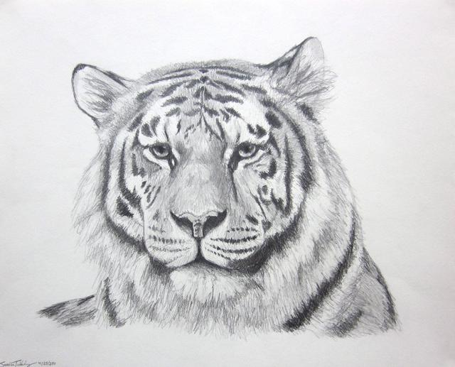
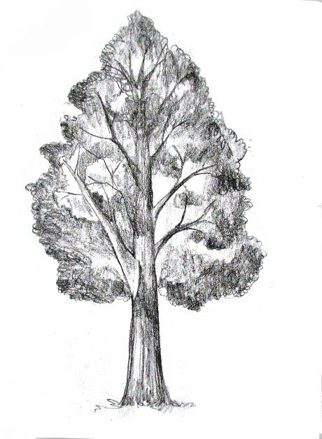

# Multi-Source/Domain Image Classification #
> Adversarial Domain Adaptation (ADA) 

Multi-class classification of images coming from multiple sources (domains).  

 

 

<!-- https://shields.io/ -->
<!--  -->

#### Content

* [Objective](#objective)

* [DataSet](#dataSet)

* [Methodology](#methodology)

* [Results](#results)

* [Conclusion](#conclusion)

<!-- #----------------------------------------------------------------------------- -->
## Objective:

* The primary objective of this project is to implement the algorithm of domain-adaptation, which is based on adversarial training (through **negative-gradient**) from the paper [1](#ref) and is in the `main` branch. 

* The models are trained on 11-classes and from three (3) sources and tested on the fourth source.

*  To perform a preliminary analysis on the performance of models:

* Trained with sources-class confounding alternatively (similar to [GAN](https://github.com/yunjey/pytorch-tutorial/blob/master/tutorials/03-advanced/generative_adversarial_network/main.py)) to learn features independent of sources of origin of data. The code is in branch `ada_confound`.

* A plain naive-training i.e. what if we consider the all source data together and simply train it as a plain multi-class classification problem. The code is in branch `plain`.         

<!-- #----------------------------------------------------------------------------- -->

## DataSet:

* Data is obtained from 2019 **Visual Domain Adaptation Challenge**. For simplicity, we only pick 11 classes, some of which are similar and only four sources. 

* Class Labels:
  * [0: `shorts`, 1: `snake`, 2: `table`, 3: `tiger`, 4: `toothbrush`, 5: `tree`, 6: `truck`, 7: `van`, 8: `wine_glass`, 9: `wristwatch`, 10: `yoga`]

* Source Labels:
  * Training: [0: `quickdraw`, 1: `real`, 2: `sketch`]
  * Testing:  [3: `infograph`]

* **Image Exmaples**:

| Real |  |  |  |  |  |  |  |  |  |  |  |
| :--: | :--: | :--: | :--: | :--: | :--: | :--: | :--: | :--: | :--: | :--: |  :--: |
| **Sketch** |  |  |  |  |  |  |  |  |  |  |  |
| **Quickdraw** |  |  |  |  |  |  |  |  |  |  |  |
| **Infographs** |  |  |  |  |  |  |  |  |  |  |  |
|**Src/Cls Labels** | *Shorts* | *Snake* | *Table* | *Tiger* | *Toothbrush* | *Tree* | *Truck* | *Van* | *Wine Glass* | *Wrist Watch* | *Yoga* |

*Figure 1*. Sample Data ([source](http://ai.bu.edu/visda-2019/#data))

<!-- # TODO: link -->
* Download the dataset used in this project from [here](https://drive.google.com/file/d/1tjH9bIesyrMZKR_x8BwXgszR-9Snna-a/view?usp=sharing). 

* To download the entire dataset, go to the official page to the [VisDA](http://ai.bu.edu/visda-2019/#data) challenge.

<!-- #----------------------------------------------------------------------------- -->
## Methodology:

Adversarial domain adaptation by Ajakan1 et. al [1](https://dl.acm.org/doi/abs/10.5555/2946645.2946704) proposes a novel way to learn a representation of data that tries to be independent of the source (domain/origin) of data. To achieve this gradient from `source-class` loss is reversed to update the parameters of feature-learner. A visual representation is given below: 

|  | 
|:--:|
| *Figure 2*. Model Architecture ([source](https://dl.acm.org/doi/abs/10.5555/2946645.2946704)) |

#### Basically the idea is as follows:

* The network is divided into three parts:
  
  * Feature Representation (FR): the deep architecture in green.
  * Label Predictor (LP): in blue.
  * Domain Predictor (DP): in pink.

* To update the parameters of `FR`, the network computes the forward pass for all the parts but the total loss is `LP` loss minus `DP` loss. Thus gradient being reversed from `DP`. Please note that only the parameters of `FR` are updated here. 

* Next, is to update the parameters of the part of the network that learns `Labels` (cls-lbl) and `Domains` (src-lbl) discriminator respectively. 

* Forward pass for the `LP` and `DP` network and respectively update the parameters. 

* We observe that training is adversarial since updating `FR` params gradient is reversed, while for `Label` and `Domain` parts gradient flows as usual. 

* The following experts from the [paper](https://dl.acm.org/doi/abs/10.5555/2946645.2946704) summarize the computation well: 

|  | 
|:--:|
| *Figure 3*. Loss Functions ([source](https://dl.acm.org/doi/abs/10.5555/2946645.2946704)): Equations 13, 14, & 15 repectively gives the update rule for the params of the three-part network. |

<!-- #----------------------------------------------------------------------------- -->
## Results:

* Models are trained for all three different approaches. On average, 400 images are used per-class per-domain, which makes a total of 13K.

* The results presented here in Table 1 are from a preliminary analysis to check which of the three approaches works best. Is the paper ([1](#ref)) claims are on the right track or does plain-classification network also work equally well? 

* Results from models saved at different checkpoint and top-3 are presented in the table as follows:

|Approach| Accuracy-1 | Accuracy-2 | Accuracy-3 |
| ------| ------| ------| ------|
|**ADA Paper (main)**| **15.33**| 14.70| 14.70|
|ADA Confound| 12.85| 12.66| 12.66| 
|Plain| 12.10| 12.05| 12.05 | 

*Table 1*: Top-3 checkpoints results

  

<!-- #----------------------------------------------------------------------------- -->
## Conclusion:

* Although, for 11 classes, the result for even the best approach (`ADA Paper`) is just better than random guessing (100/11 = 9.1%) but provides the empirical-evidence to explore the adversarial-domain adaptation approach much further in case of multi-source data.

* Moreover, the models are trained only on a very small dataset i.e. 400 images per class and source and despite that, naive training clearly shows the difference. 

A lot of experimentation is needed to see the method's efficacy and also compare with different adaptation techniques. 

<!-- #----------------------------------------------------------------------------- -->
## References:

[1]. Ganin, Yaroslav, Evgeniya Ustinova, Hana Ajakan, Pascal Germain, Hugo Larochelle, François Laviolette, Mario Marchand, and Victor Lempitsky. "Domain-adversarial training of neural networks." The Journal of Machine Learning Research 17, no. 1 (2016): 2096-2030.

[2]. Ajakan, Hana, Pascal Germain, Hugo Larochelle, François Laviolette, and Mario Marchand. "Domain-adversarial neural networks." arXiv preprint arXiv:1412.4446 (2014).

[3]. Visual Domain Adaptation Challenge (VisDA-2019), "Multi-Source Domain Adaptation and Semi-Supervised Domain Adaptation" tasks, 2019-2020

